<picture><source media="(prefers-color-scheme: dark)" srcset="./assets/banner-dark.svg"></picture>

 

<picture><source media="(prefers-color-scheme: dark)" srcset="./assets/section-intro-dark.svg"></picture>

<picture><source media="(prefers-color-scheme: dark)" srcset="./assets/intro-dark.svg"></picture>

 

<picture><source media="(prefers-color-scheme: dark)" srcset="./assets/section-savoir-faire-dark.svg"></picture>

<picture><source media="(prefers-color-scheme: dark)" srcset="./assets/sf-mobile-dark.svg"></picture>
<picture><source media="(prefers-color-scheme: dark)" srcset="./assets/sf-web-dark.svg">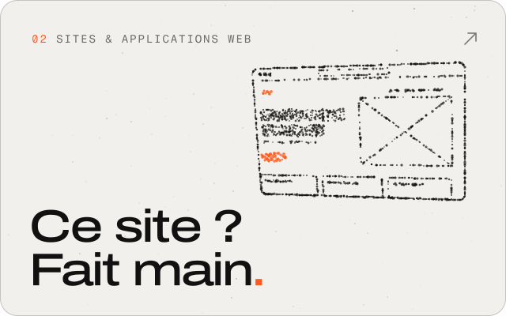</picture>
 
<picture><source media="(prefers-color-scheme: dark)" srcset="./assets/sf-ia-dark.svg"></picture>
<picture><source media="(prefers-color-scheme: dark)" srcset="./assets/sf-automatisation-dark.svg"></picture>
 
<picture><source media="(prefers-color-scheme: dark)" srcset="./assets/sf-backend-dark.svg"></picture>
<picture><source media="(prefers-color-scheme: dark)" srcset="./assets/sf-data-dark.svg"></picture>
 
<picture><source media="(prefers-color-scheme: dark)" srcset="./assets/sf-design-dark.svg">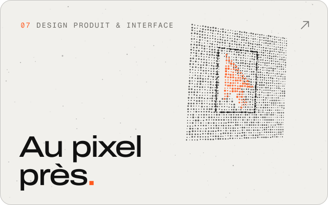</picture>
<picture><source media="(prefers-color-scheme: dark)" srcset="./assets/sf-lancement-dark.svg"></picture>

 

<picture><source media="(prefers-color-scheme: dark)" srcset="./assets/section-stack-dark.svg"></picture>

<picture><source media="(prefers-color-scheme: dark)" srcset="./assets/stack-dark.svg"></picture>

 

<picture><source media="(prefers-color-scheme: dark)" srcset="./assets/section-contact-dark.svg"></picture>

<picture><source media="(prefers-color-scheme: dark)" srcset="./assets/contact-dark.svg"></picture>

 

<picture><source media="(prefers-color-scheme: dark)" srcset="./assets/footer-dark.svg"></picture>
